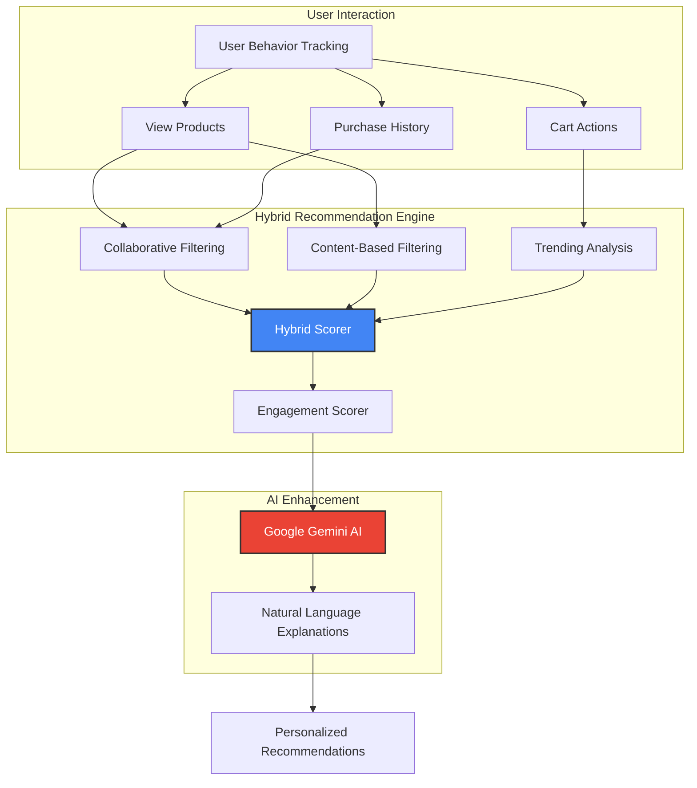

# <i>**E-Commerce** with Hybrid Recommendations</i>

A Next.js 15 storefront featuring intelligent product recommendations using a **`hybrid approach`** that combines **`collaborative filtering`**, **`content-based matching`**, and **`trending analysis`**, enhanced with **`Google Gemini AI`** for natural language explanations.

---

<samp>

> [!IMPORTANT]
> **Prerequisites**: This project requires a Medusa backend server running on port 9000 and API keys for Google Gemini AI.  
> Make sure to set up your environment variables before running the application.

> [!NOTE]
> **Purpose**: This is a demonstration of advanced recommendation algorithms in e-commerce.  
> The hybrid approach provides personalized shopping experiences by understanding user behavior patterns.

## ✨ Features

- **`Hybrid Recommendation Engine`** : Combines collaborative filtering, content-based matching, and trending analysis
- **`AI-Powered Explanations`** : Google Gemini AI generates natural language explanations for recommendations
- **`User Behavior Tracking`** : Advanced engagement scoring with view duration, interactions, cart actions, and purchases
- **`Real-time Personalization`** : Dynamic recommendations based on user behavior and session data
- **`Next.js 15 App Router`** : Modern React architecture with Server Components and Server Actions
- **`Full E-Commerce Features`** : Complete shopping cart, checkout, user accounts, and order management
- **`Responsive Design`** : Built with Tailwind CSS for mobile-first responsive experiences
- **`TypeScript`** : End-to-end type safety for robust development

## 🏗️ Hybrid Recommendation Architecture



## ⬇️ Installation

1. **Clone the repository**
   ```bash
   git clone https://github.com/yourusername/nextjs-starter-medusa.git
   cd nextjs-starter-medusa
   ```

2. **Install dependencies**
   ```bash
   yarn install
   # or npm install
   ```

3. **Set up environment variables**
   
   Create `.env.local` in the project root:
   ```bash
   # Medusa Backend
   MEDUSA_BACKEND_URL=http://localhost:9000
   NEXT_PUBLIC_MEDUSA_PUBLISHABLE_KEY=your_publishable_key
   
   # Google Gemini AI
   GEMINI_API_KEY=your_gemini_api_key
   
   # Unsplash (optional)
   NEXT_PUBLIC_UNSPLASH_ACCESS_KEY=your_unsplash_access_key
   
   # Base URL
   NEXT_PUBLIC_BASE_URL=http://localhost:8000
   ```

4. **Start Medusa backend**
   ```bash
   npx create-medusa-app@latest
   ```
   See [Medusa documentation](https://docs.medusajs.com/learn/installation) for details.

5. **Start the development server**
   ```bash
   yarn dev
   # or npm run dev
   ```

6. **Open your browser**
   ```
   http://localhost:8000
   ```

## 🛠️ Usage

Once installed, the application will:
- Track user behavior automatically as users browse products
- Generate personalized recommendations using the hybrid algorithm
- Provide AI-powered explanations via Google Gemini for each recommendation
- Display recommendations on the homepage, product pages, and cart

## 📊 Technology Stack

| Component | Technology |
| :--- | :--- |
| **Frontend** | Next.js 15 (React 19 RC) |
| **AI Engine** | Google Gemini AI |
| **Recommendations** | Custom Hybrid Algorithm |
| **Styling** | Tailwind CSS + Radix UI |
| **Language** | TypeScript |

## 📁 Project Structure

```
nextjs-starter-medusa/
├── src/
│   ├── app/                           # Next.js 15 App Router
│   │   ├── [countryCode]/            # Region-based routing
│   │   │   └── (main)/               # Main storefront routes
│   │   │       ├── page.tsx          # Homepage with recommendations
│   │   │       ├── account/          # User account management
│   │   │       ├── cart/             # Shopping cart
│   │   │       ├── categories/       # Product categories
│   │   │       ├── collections/      # Product collections
│   │   │       ├── products/         # Product detail pages
│   │   │       ├── recommendations/  # AI recommendation showcase
│   │   │       └── store/            # Product listing
│   │   └── api/                      # API routes
│   │       ├── recommendations/      # Recommendation endpoint
│   │       └── unsplash-image/       # Image fetching endpoint
│   │
│   ├── lib/                          # Core business logic
│   │   ├── recommendation-engine.ts  # Hybrid recommendation algorithms
│   │   ├── gemini-service.ts         # Google Gemini AI integration
│   │   ├── config.ts                 # Medusa SDK configuration
│   │   ├── constants.tsx             # App-wide constants
│   │   ├── context/                  # React Context providers
│   │   ├── data/                     # Data fetching utilities
│   │   ├── hooks/                    # Custom React hooks
│   │   └── util/                     # Helper functions
│   │
│   ├── modules/                      # Feature modules
│   │   ├── account/                  # Account management components
│   │   ├── cart/                     # Cart functionality
│   │   ├── categories/               # Category browsing
│   │   ├── collections/              # Collection templates
│   │   ├── common/                   # Shared components
│   │   ├── home/                     # Homepage components
│   │   ├── layout/                   # Layout components
│   │   ├── products/                 # Product components
│   │   ├── recommendations/          # Recommendation UI
│   │   ├── skeletons/                # Loading skeletons
│   │   └── store/                    # Store components
│   │
│   ├── styles/                       # Global styles
│   │   └── globals.css               # Tailwind + custom CSS
│   │
│   ├── types/                        # TypeScript definitions
│   │   ├── global.ts                 # Global type definitions
│   │   ├── icon.ts                   # Icon component types
│   │   └── recommendation.ts         # Recommendation system types
│   │
│   └── middleware.ts                 # Next.js middleware
│
├── public/                           # Static assets
│   └── favicon.ico
│
├── .env.local                        # Environment variables
├── next.config.js                    # Next.js configuration
├── tailwind.config.js                # Tailwind CSS configuration
├── tsconfig.json                     # TypeScript configuration
└── package.json                      # Dependencies
```

## 🎯 Core Components

### 1. **Recommendation Engine** (`src/lib/recommendation-engine.ts`)

**Multi-Algorithm Hybrid System:**

- **Collaborative Filtering:** Finds similar users based on behavior patterns and recommends products those users liked
- **Content-Based Filtering:** Matches products based on category, attributes, and tags
- **Trending Detection:** Identifies popular products based on view counts and engagement
- **Engagement Scoring:** Advanced scoring system considering:
  - View duration and count
  - Product interactions (size/color selection, image zoom, reviews)
  - Cart actions (adds/removes with frequency tracking)
  - Checkout behavior (proceeding to checkout, purchases, repeat purchases)
  - User ratings (1-5 stars)

**Key Features:**
```typescript
- calculateEngagementScore(): Weighted scoring algorithm
- findSimilarUsers(): Cosine similarity for collaborative filtering
- contentBasedRecommendations(): Category and attribute matching
- getTrendingProducts(): Popularity-based recommendations
- generateRecommendations(): Hybrid approach combining all algorithms
```

### 2. **Google Gemini AI Service** (`src/lib/gemini-service.ts`)

**Natural Language Explanations:**

- Generates human-readable explanations for why products are recommended
- Enriches recommendations with dynamic product images from Unsplash
- Handles different recommendation types (collaborative, content-based, trending, hybrid)
- Structured prompt engineering for consistent, high-quality outputs

**Key Features:**
```typescript
- explainRecommendations(): LLM-powered explanation generation
- fetchUnsplashImage(): Dynamic product imagery
- Structured JSON responses with product details
- Error handling and fallback mechanisms
```

### 3. **User Behavior Tracking** (`src/types/recommendation.ts`)

**Comprehensive Tracking Interface:**
```typescript
interface UserBehavior {
  userId: string
  viewedProducts: string[]
  purchasedProducts: string[]
  cartItems: string[]
  searchQueries?: string[]
  productInteractions?: Record<string, ProductInteraction>
  sessionDuration?: number
  deviceType?: 'mobile' | 'tablet' | 'desktop'
  location?: string
  timeOfDay?: 'morning' | 'afternoon' | 'evening' | 'night'
}
```

### 4. **API Routes** (`src/app/api/`)

**RESTful Endpoints:**
- `/api/recommendations` - POST endpoint for generating recommendations
- `/api/unsplash-image` - GET endpoint for fetching product images

### 5. **Modular Components** (`src/modules/`)

**Feature-Based Organization:**
- **Account Module:** Login, register, profile management, order history
- **Cart Module:** Cart items, recommendations, checkout flow
- **Product Module:** Detail pages, image galleries, variant selection
- **Recommendation Module:** AI-powered suggestion display with explanations
- **Common Module:** Shared UI components, icons, utilities

## 🔧 Configuration

### Recommendation Engine Settings

```typescript
// src/lib/recommendation-engine.ts
const CONFIG = {
  similarityThreshold: 0.3,        // Minimum similarity for collaborative filtering
  maxRecommendations: 5,           // Number of recommendations to return
  trendingWindow: 30,              // Days to consider for trending
  engagementWeights: {
    viewDuration: 0.3,
    interactions: 0.3,
    cartActions: 0.2,
    purchases: 0.2
  }
}
```

### Gemini AI Settings

```typescript
// src/lib/gemini-service.ts
const modelConfig = {
  model: 'gemini-1.5-flash',       // Or 'gemini-pro'
  temperature: 0.7,                // Creativity level (0-1)
  maxOutputTokens: 2048,           // Response length
  topP: 0.9,
  topK: 40
}
```

### Medusa Backend Configuration

```typescript
// src/lib/config.ts
export const sdk = new Medusa({
  baseUrl: MEDUSA_BACKEND_URL,
  debug: process.env.NODE_ENV === "development",
  publishableKey: process.env.NEXT_PUBLIC_MEDUSA_PUBLISHABLE_KEY,
})
```

## 📚 Resources

- **[Medusa Documentation](https://docs.medusajs.com/)** - Backend commerce platform
- **[Next.js 15 Documentation](https://nextjs.org/docs)** - Frontend framework
- **[Google Gemini AI](https://ai.google.dev/)** - AI integration
- **[Tailwind CSS](https://tailwindcss.com/docs)** - Styling framework

## 📄 License

This project is licensed under the MIT License - see the [LICENSE](LICENSE) file for details.

</samp>


