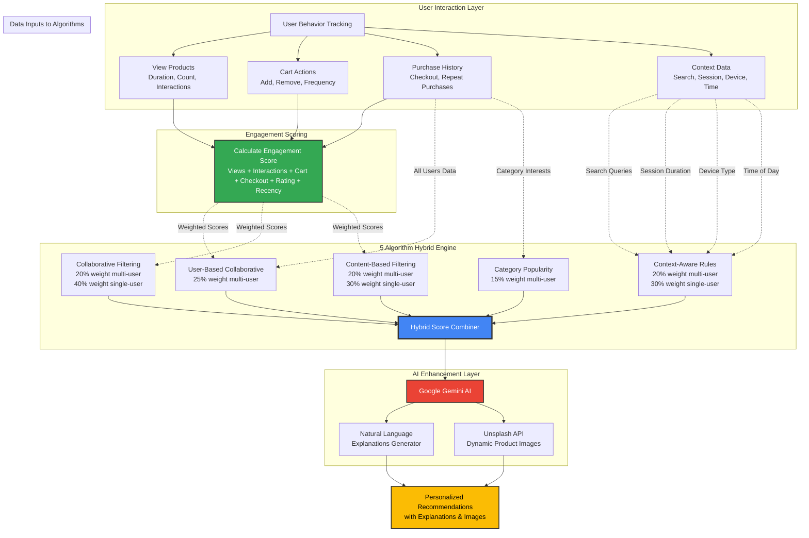

# <i>**E-Commerce** with Hybrid Recommendations</i>

A Next.js 15 storefront featuring intelligent product recommendations using a **`hybrid approach`** that combines **`collaborative filtering`**, **`content-based matching`**, and **`trending analysis`**, enhanced with **`Google Gemini AI`** for natural language explanations.

---

<samp>

> [!IMPORTANT]
> **Prerequisites**: This project requires API key for Google Gemini AI & Unsplash API key for Product Images.  
> Make sure to set up your environment variables before running the application.

> [!NOTE]
> **Purpose**: This is a demonstration of advanced recommendation algorithms in e-commerce.  
> The hybrid approach provides personalized shopping experiences by understanding user behavior patterns.

## 🎥 Demo Video
https://github.com/user-attachments/assets/d80a264d-fc55-4238-a5eb-4335a08eb852

## 🏗️ Hybrid Recommendation Architecture



**Key Components:**

1. **User Interaction Layer** - Captures all user behaviors (views, cart, purchases, context)
2. **Engagement Scoring** - Converts interactions into weighted engagement scores
3. **5-Algorithm Hybrid Engine** - Runs all algorithms in parallel with dynamic weighting
4. **AI Enhancement Layer** - Generates explanations and enriches with images
5. **Output** - Personalized recommendations with human-readable explanations

---

## � Recommendation Engine - Deep Dive

The hybrid recommendation engine combines **5 powerful algorithms** that work together to provide highly personalized product recommendations. The system is designed to be **dynamic and robust**, working with whatever user data is available.


### 🎯 **Algorithm Overview**

| Algorithm | Weight (Multi-User) | Weight (Single User) | Primary Purpose |
|-----------|---------------------|----------------------|-----------------|
| **User-Based Collaborative** | 25% | N/A | Find similar users and recommend their favorites |
| **Collaborative Filtering** | 20% | 40% | Match user preferences (category, price, engagement) |
| **Content-Based Filtering** | 20% | 30% | Product similarity based on attributes and tags |
| **Context-Aware Rules** | 20% | 30% | Contextual factors (time, device, session, search) |
| **Category Popularity** | 15% | N/A | Trending items in user's interested categories |

### 1️⃣ **User-Based Collaborative Filtering**

**Purpose:** Discovers users with similar taste and recommends products they loved.

**How it works:**
```
1. Build category interest profile for target user
2. Find similar users based on:
   - Common product interactions (overlap in viewed/purchased items)
   - Category interest similarity (matching preferences)
   - Engagement level similarity (how deeply they interact)
3. Calculate similarity score using weighted overlap
4. Take top 10 most similar users
5. Recommend products those users engaged with (but target user hasn't seen)
6. Weight recommendations by similarity score and popularity
```

**Similarity Calculation:**
```typescript
similarity = 
  + Product overlap engagement (min engagement of both users)
  + Category interest similarity (normalized by max interest)
  + Log boost for common products: log(commonProducts + 1)
```

**Key Features:**
- Excludes target user from comparison (no self-recommendation)
- Weights by engagement score (purchases > cart adds > views)
- Popularity boost: `log(count + 1) * 0.2`
- Requires at least 1 other user to function

**Example:**
```
User A: Purchased laptop, viewed mouse, added keyboard to cart
User B: Purchased laptop + chair, viewed desk
Similarity: High (both purchased laptop, interested in work setup)
→ Recommend chair and desk to User A
```

### 2️⃣ **Collaborative Filtering**

**Purpose:** Recommends products similar to what the user already likes, based on their preference profile.

**How it works:**
```
1. Build user preference profile:
   - Category preferences (weighted by engagement)
   - Price range preferences (min, max, avg)
2. Score each product based on:
   - Category match (40% weight)
   - Price similarity (30% weight)
   - Product similarity to interacted items (30% weight)
3. Product similarity considers:
   - Same category (+0.5)
   - Tag overlap (+0.1 per common tag)
   - Engagement-weighted scoring
```

**Fallback for New Users:**
- If user has NO interactions: Random trending score (0-0.5) + mid-range price boost (+0.3 for $50-$300)
- Ensures recommendations even with zero data

**Example:**
```
User viewed: $1299 laptop (Electronics), $449 chair (Furniture)
Avg price: ~$874, Categories: Electronics, Furniture
→ Recommend: $599 monitor (Electronics, similar price range)
→ Recommend: $699 desk (Furniture, similar price range)
```

### 3️⃣ **Content-Based Filtering**

**Purpose:** Finds products similar in features, attributes, and characteristics to items the user engaged with.

**How it works:**
```
1. Get all products user interacted with + engagement scores
2. For each candidate product, calculate similarity to interacted products:
   - Category match: +0.5
   - Tag overlap: +0.15 per common tag
   - Price similarity: price_ratio * 0.25
   - Description keyword overlap: +0.05 per common word (>3 chars)
3. Weight by engagement score of interacted product
4. Average similarity across all interacted products
```

**Similarity Formula:**
```typescript
similarity = 
  + 0.5 (if same category)
  + 0.15 * commonTags.length
  + 0.25 * (minPrice / maxPrice)
  + 0.05 * commonKeywords.length

finalScore = (similarity * engagement) / totalWeight
```

**Returns empty if user has no interactions** (graceful degradation).

**Example:**
```
User purchased: "Mechanical RGB Keyboard" (Electronics, gaming, rgb, mechanical)
Similar product: "Gaming Mouse" (Electronics, gaming, rgb)
Similarity: 0.5 (category) + 0.3 (2 tags) = 0.8 → High match
```

### 4️⃣ **Context-Aware Rules**

**Purpose:** Applies contextual intelligence based on user behavior patterns, session data, and search intent.

**Contextual Factors Analyzed:**

**A. Price Intelligence**
- Calculates user's average price range (engagement-weighted)
- Scores products within ±20% of user's price range
- High-engagement users → Boost premium products (+0.25)

**B. Search Query Matching** 🆕
```typescript
- Extracts all search terms (filters words < 3 chars)
- Matches against: product name + description + tags + category
- Score boost: matchPercentage * 0.5 (up to +0.5 for perfect match)
```
**Example:**
```
Search: "ergonomic office chair"
Product: "Ergonomic Office Chair with Lumbar Support"
Match: 3/3 words = 100% → +0.5 boost
```

**C. Session Duration Analysis** 🆕
```typescript
- Normalizes session (1800s = 30min = full engagement)
- High engagement (>50%, >15min):
  → Boost premium products (price > $50): +0.2
- Low engagement (<30%, <9min):
  → Boost budget products (price < $100): +0.15
```

**D. Time-of-Day Personalization**
- Evening users → Premium product boost (+0.15 for price > $100)
- Hypothesis: Evening browsers more willing to explore expensive items

**E. Device-Type Optimization**
- Mobile users → Mid-range preference (+0.1 for $20-$100)
- Hypothesis: Mobile users prefer quick, affordable purchases

**F. Fallback for No Data**
- If user has NO interactions:
  - Mid-range products ($50-$500): +0.5
  - Random trending factor: +0.3

**Example:**
```
User: 30min session, evening, searched "laptop", desktop device
Product: $1299 Premium Laptop Pro
Score boosts:
  + 0.2 (high session engagement, premium product)
  + 0.15 (evening, premium product)
  + 0.5 (perfect search match for "laptop")
  = +0.85 total contextual boost
```

### 5️⃣ **Category Popularity Score**

**Purpose:** Boosts trending products within categories the user is interested in.

**How it works:**
```
1. Identify user's interested categories (from their interactions)
2. Calculate product popularity across ALL users (engagement-weighted)
3. Organize popularity by category
4. Score products based on:
   - Normalized popularity (total engagement / number of users)
   - User's interest level in that category
5. Formula: normalizedPopularity * min(categoryInterest, 1.0)
```

**Returns empty if:**
- No other users available
- User has no category interests

**Example:**
```
User: High interest in Electronics (engaged with 5 Electronics products)
Product: Wireless Mouse (Electronics)
  - 50 users engaged with it (high popularity)
  - Normalized: 50 / 100 users = 0.5
  - User interest: 0.8
  - Score: 0.5 * 0.8 = 0.4
```

---

### 💯 **Engagement Scoring System**

Every user interaction is converted to an **engagement score** that weights recommendation algorithms.

**Engagement Formula:**

```typescript
score = 0

// View Behavior
+ min(viewDuration / 60, 1) * 0.3        // Up to 0.3 for 60+ seconds
+ min(viewCount / 5, 1) * 0.2            // Up to 0.2 for 5+ views

// Interactions (sizeSelected, colorSelected, imageZoomed, descriptionRead, reviewsRead)
+ (trueInteractionCount / 5) * 0.3       // Up to 0.3 for all 5 interactions

// Cart Actions
+ 0.5 (if addedToCart)                   // Strong purchase intent
+ min(timesAddedToCart * 0.2, 0.6)       // Multiple adds = higher intent
- 0.3 (if removedFromCart)               // Negative signal
- min(timesRemovedFromCart * 0.15, 0.4)  // Multiple removes = strong disinterest

// Checkout Actions
+ 0.7 (if proceededToCheckout)           // Very strong signal
+ 1.5 (if completedPurchase)             // Strongest signal
+ min(purchaseCount * 0.5, 2.0)          // Repeat purchases = loyalty

// Explicit Feedback
+ (rating / 5) * 0.4                     // Up to 0.4 for 5-star rating

// Recency Bonus
+ max(0, 1 - daysSince / 30) * 0.3       // Decays over 30 days

return max(0, score)  // Non-negative
```

**Maximum Possible Score:** ~6.5 (purchased product with 5-star rating, high engagement, recent)

---

### 🔄 **Dynamic & Robust Design**

The recommendation engine is designed to work with **minimal or partial data**:

#### ✅ **Graceful Degradation:**

| User Data Provided | Algorithms Active | Fallback Strategy |
|-------------------|-------------------|-------------------|
| **Full data** (interactions, purchases, ratings, search, session) | All 5 algorithms | Optimal personalization |
| **Basic interactions** (viewed products only) | 3 algorithms (Collaborative, Content, Context) | Good personalization |
| **Just user ID** (no interactions) | Context-Aware only | Trending + mid-range recommendations |
| **Multiple users** (collaborative data available) | All 5 algorithms | Enhanced with user-based filtering |
| **Single user** (no collaborative data) | 3 algorithms | Content + Context focus |

#### ✅ **Optional Fields Supported:**

All UserBehavior fields except `userId` are **optional**:
- `viewedProducts?` - Legacy support
- `purchasedProducts?` - Legacy support  
- `cartItems?` - Legacy support
- `searchQueries?` - Search intent matching
- `ratings?` - Explicit feedback
- `productInteractions?` - Enhanced tracking
- `sessionDuration?` - Engagement level
- `deviceType?` - Device optimization
- `timeOfDay?` - Temporal patterns

The engine uses `?.` optional chaining throughout to safely access properties.

---

## 🎲 **Score Combination Logic**

**Multi-User Mode** (when `allUserBehaviors` provided):
```typescript
finalScore = 
  + userBasedScore       * 0.25  // Similar users
  + collaborativeScore   * 0.20  // User preferences
  + contentScore         * 0.20  // Product similarity
  + contextScore         * 0.20  // Contextual rules
  + popularityScore      * 0.15  // Trending in category
```

**Single-User Mode** (no collaborative data):
```typescript
finalScore = 
  + collaborativeScore   * 0.40  // User preferences (higher weight)
  + contentScore         * 0.30  // Product similarity (higher weight)
  + contextScore         * 0.30  // Contextual rules (higher weight)
```

**Normalization:** Scores are normalized to 0-1 scale before combination.

---

### 🚀 **Key Advantages**

1. `**Hybrid Approach**` - Combines strengths of all algorithms, mitigates weaknesses
2. `**Cold Start Resilient**` - Works even with zero user data (trending + contextual)
3. `**Engagement-Weighted**` - Purchases matter more than views (behavioral economics)
4. `**Context-Aware**` - Considers time, device, session, search intent
5. `**Search-Enhanced**` - Matches user's explicit search queries 🆕
6. `**Session-Intelligent**` - Adapts to user engagement level 🆕
7. `**Multi-User Learning**` - Leverages collective intelligence when available
8. `**Scalable**` - Efficient algorithms (Map/Set data structures, top-N selection)
9. `**Type-Safe**` - Full TypeScript support with strict typing
10. `**Explainable**` - Each score includes breakdown showing contribution of each algorithm

---

### 📈 **Performance Characteristics**

- **Time Complexity:** O(U * P) where U = users, P = products
- **Space Complexity:** O(P) for score maps
- **Optimization:** 
  - Early returns for empty data
  - Map/Set for O(1) lookups
  - Top-N selection without full sort (slice)
  - Lazy evaluation of similarity scores

---

## ⬇️ Installation

1. **Clone the repository**
   ```bash
   git clone https://github.com/yourusername/nextjs-starter-medusa.git
   cd nextjs-starter-medusa
   ```

2. **Install dependencies**
   ```bash
   yarn install
   ```

3. **Set up environment variables**
   
   Create `.env.local` in the project root:
   ```bash

   # Google Gemini AI
   GEMINI_API_KEY=your_gemini_api_key
   
   # Unsplash (optional)
   NEXT_PUBLIC_UNSPLASH_ACCESS_KEY=your_unsplash_access_key
   
   # Base URL
   NEXT_PUBLIC_BASE_URL=http://localhost:8000
   ```

4. **Start the development server**
   ```bash
   yarn dev
   # or npm run dev
   ```

5. **Open your browser**
   ```
   http://localhost:8000
   ```

## 💻 Tech Stack

| Component | Technology |
| :--- | :--- |
| **Frontend** | Next.js 15 (React 19 RC) |
| **AI Engine** | Google Gemini AI |
| **Recommendations** | Custom Hybrid Algorithm |
| **Styling** | Tailwind CSS + Radix UI |
| **Language** | TypeScript |

## 📁 Project Structure

```
nextjs-starter-medusa/
├── src/
│   ├── app/                           # Next.js 15 App Router
│   │   ├── [countryCode]/            # Region-based routing
│   │   │   └── (main)/               # Main storefront routes
│   │   │       ├── page.tsx          # Homepage with recommendations
│   │   │       ├── account/          # User account management
│   │   │       ├── cart/             # Shopping cart
│   │   │       ├── categories/       # Product categories
│   │   │       ├── collections/      # Product collections
│   │   │       ├── products/         # Product detail pages
│   │   │       ├── recommendations/  # AI recommendation showcase
│   │   │       └── store/            # Product listing
│   │   └── api/                      # API routes
│   │       ├── recommendations/      # Recommendation endpoint
│   │       └── unsplash-image/       # Image fetching endpoint
│   │
│   ├── lib/                          # Core business logic
│   │   ├── recommendation-engine.ts  # Hybrid recommendation algorithms
│   │   ├── gemini-service.ts         # Google Gemini AI integration
│   │   ├── config.ts                 # Medusa SDK configuration
│   │   ├── constants.tsx             # App-wide constants
│   │   ├── context/                  # React Context providers
│   │   ├── data/                     # Data fetching utilities
│   │   ├── hooks/                    # Custom React hooks
│   │   └── util/                     # Helper functions
│   │
│   ├── modules/                      # Feature modules
│   │   ├── account/                  # Account management components
│   │   ├── cart/                     # Cart functionality
│   │   ├── categories/               # Category browsing
│   │   ├── collections/              # Collection templates
│   │   ├── common/                   # Shared components
│   │   ├── home/                     # Homepage components
│   │   ├── layout/                   # Layout components
│   │   ├── products/                 # Product components
│   │   ├── recommendations/          # Recommendation UI
│   │   ├── skeletons/                # Loading skeletons
│   │   └── store/                    # Store components
│   │
│   ├── styles/                       # Global styles
│   │   └── globals.css               # Tailwind + custom CSS
│   │
│   ├── types/                        # TypeScript definitions
│   │   ├── global.ts                 # Global type definitions
│   │   ├── icon.ts                   # Icon component types
│   │   └── recommendation.ts         # Recommendation system types
│   │
│   └── middleware.ts                 # Next.js middleware
│
├── public/                           # Static assets
│   └── favicon.ico
│
├── .env.local                        # Environment variables
├── next.config.js                    # Next.js configuration
├── tailwind.config.js                # Tailwind CSS configuration
├── tsconfig.json                     # TypeScript configuration
└── package.json                      # Dependencies
```

## 📚 Resources

- **[Medusa Documentation](https://docs.medusajs.com/)** - Backend commerce platform
- **[Next.js 15 Documentation](https://nextjs.org/docs)** - Frontend framework
- **[Google Gemini AI](https://ai.google.dev/)** - AI integration
- **[Tailwind CSS](https://tailwindcss.com/docs)** - Styling framework

## 📄 License

This project is licensed under the MIT License - see the [LICENSE](LICENSE) file for details.

</samp>
